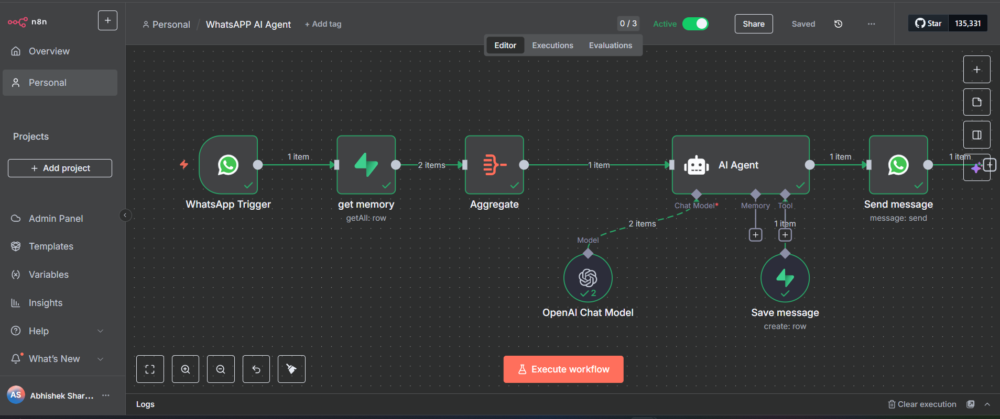

# WhatsApp AI Customer Support Agent (n8n + OpenAI + Supabase Memory)

## Problem
Customers on WhatsApp expect instant replies, but businesses often take hours to respond or repeat the same answers.

##Solution (n8n Workflow)

- WhatsApp Trigger: captures incoming messages in real time.
- Get Memory (Supabase): fetches past conversation history stored in Supabase.
- Aggregate: structures input for AI processing.
- AI Agent: orchestrates the response logic.
- OpenAI Chat Model: generates contextual replies.
- Save Message (Supabase): stores the new conversation turn back into Supabase.
- Send Message (WhatsApp): replies instantly to the customer.

## Result

- Delivers instant, contextual responses on WhatsApp.
- Ensures continuity with stored memory.
- Provides clear logs for every exchange.
- Demo metric: reduces first response time to under 2 minutes, and can handle 70%+ of common questions without human intervention.

## Stack

- n8n (automation platform)
- WhatsApp Cloud API (messaging)
- OpenAI Chat Model (AI responses)
- Supabase (database for conversation memory & logs)

## How to Run (Demo)
1. Import `workflow.json` into n8n (this export is sanitized; set your own credentials).
2. Create the required credentials in n8n (WhatsApp/Telegram/OpenAI/etc.).
3. Create a Google Sheet / Notion DB / Airtable base as needed.
4. Update node IDs/URLs in the workflow to match your resources.
5. Trigger the entry node (Cron/Webhook/Gmail) with sample data from `/sample-data`.

## Repo Structure
```
/
├─ README.md
├─ workflow.json            # sanitized; no secrets
├─ /screenshots             # add 2–4 PNGs (flow overview & success logs)
├─ /sample-data             # example payloads (JSON/CSV)
└─ LICENSE                  # MIT license
```

## Screenshots


## Notes on Credentials & Safety
- This repo does **not** include secrets. Configure credentials inside n8n.
- Replace any test tokens/IDs with your own before running.
